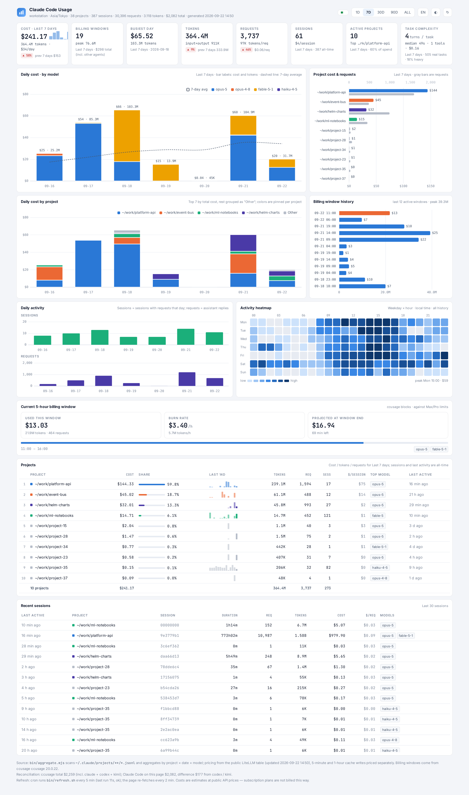

# ccusage-dashboard

English · [简体中文](README.md)

A local dashboard for Claude Code usage: tokens and estimated cost by day, project, model and task. One static page plus a cron job — no backend process.



<sub>Screenshot uses anonymized demo data</sub>

## Features

- 8 KPIs (cost, tokens, requests, sessions, billing windows, task complexity, …), all driven by the `1D / 7D / 30D / 90D / ALL` picker
- Daily cost by model, project ranking, billing-window history, activity heatmap, project and session tables
- Task-level analysis: transcripts are split into tasks per user prompt, with turns, tool calls, context size and duration
- English / 中文 and light / dark, switchable in one click
- Reads local files only; nothing is uploaded

## Quick start

Requires Node.js ≥ 18, nginx, cron, and Claude Code transcripts on this machine (`~/.claude/projects`).

```bash
git clone https://github.com/ZhangYongguang5467/ccusage-dashboard.git
cd ccusage-dashboard
bin/dash install      # deps + data + cron + nginx site; sudo is used only for nginx
```

Open <http://localhost:8090/>. Another port: `PORT=8091 bin/dash install`.

On a remote machine, use an SSH tunnel (`ssh -L 8090:localhost:8090 <host>`). The page shows project paths and cost — don't expose the port.

## Commands

| Command | What it does |
|---|---|
| `bin/dash status` | Site, cron and data freshness |
| `bin/dash stop` / `start` / `restart` | Disable / enable the site and cron; data is kept |
| `bin/dash refresh` | Regenerate the data now |
| `bin/dash uninstall` | Stop and delete data / logs / node_modules |

## How it works

Every 5 minutes cron runs `bin/refresh.sh`: ccusage exports its JSON, then `bin/aggregate.mjs` scans `~/.claude/projects/**/*.jsonl` and writes `www/data/*.json`. nginx serves `www/` as-is; the page renders with Chart.js and re-fetches every 2 minutes.

```
bin/dash              entry point: install / start / stop / status / refresh / uninstall
bin/refresh.sh        the cron job
bin/aggregate.mjs     aggregation + task segmentation
nginx/*.template      site template, rendered with the repo path at install time
www/index.html        the page — single file, no build step
www/data/             generated data, gitignored
```

## Metrics

- **Cost**: tokens × public LiteLLM prices; input, output, cache write (5m / 1h) and cache read priced separately. Estimates only — subscription plans are not billed this way
- **Dedup**: same as ccusage (`message.id + requestId`); `<synthetic>` is skipped
- **Tasks**: one user prompt through every turn before the next. A *real task* has ≥1 tool call or ≥3 turns; a *heavy task* compacted its context, made ≥20 tool calls, or reached ≥500K context
- **Billing windows**: from ccusage blocks, which include other agents on the machine (codex, kimi, …), so their total exceeds the Claude Code cost shown here
- Days follow the local timezone; the footer reconciles against ccusage

## Configuration

- Port: `PORT=8091 bin/dash install`
- Project aliases: `www/data/aliases.json` (gitignored), e.g. `{ "-home-me-work-repo": "nicer name" }`; the key is the cwd with `/` replaced by `-`
- URL params: `?lang=en|zh`, `?theme=dark|light`

## Privacy

Only local files are read and no usage data leaves the machine. The single outbound request fetches the LiteLLM price table once every 24h, falling back to the cache. `www/data/` contains project paths and the hostname; it is gitignored — don't commit it.

## License

MIT
