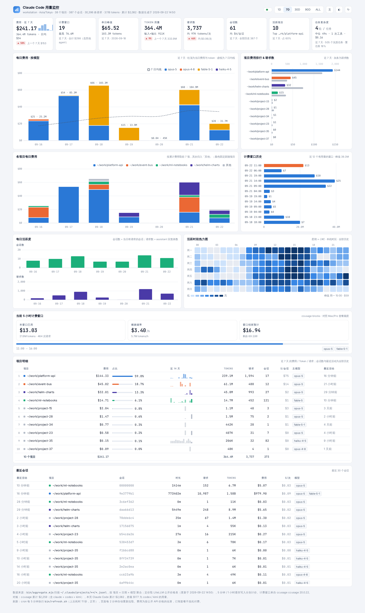

# ccusage-dashboard

[English](README.en.md) · 简体中文

本机 Claude Code 用量看板：按天 / 项目 / 模型 / 任务展示 token 消耗与估算费用。中英双语，跟随系统深浅色。

纯静态页面 + cron 定时生成 JSON，nginx 只做静态文件服务，不需要后端进程。



> 截图用的是脱敏后的演示数据。

```
.
├── bin/aggregate.mjs   # 扫 ~/.claude/projects/**/*.jsonl，按 项目×日期×模型 聚合 + 任务段切分
├── bin/refresh.sh      # cron 每 5 分钟跑：ccusage JSON + aggregate.mjs → www/data/
├── bin/dash            # 唯一入口：install / start / stop / status / refresh / uninstall
├── bin/install-nginx.sh# 渲染 nginx 配置并启用站点（bin/dash 内部调用）
├── bin/uninstall-nginx.sh # 停用站点
├── nginx/*.template    # 站点模板，安装时替换 __ROOT__ / __PORT__
├── www/index.html      # 单文件页面（Chart.js，无构建步骤）
└── www/data/*.json     # 生成的数据，不进 git
```

## 依赖

- Node.js ≥ 18（用到全局 `fetch`）
- nginx，或任意能服务静态目录的工具
- cron（可选，用于每 5 分钟自动刷新）
- 本机已有 Claude Code 的会话记录：`~/.claude/projects/**/*.jsonl`

## 隐私

全程只读本机文件，不上传任何用量数据。唯一的外网请求是每 24 小时拉一次 LiteLLM 的公开价格表（`raw.githubusercontent.com`），失败就退回本地缓存；`ccusage` 也带 `--offline` 兜底。

## 安装

```bash
git clone https://github.com/ZhangYongguang5467/ccusage-dashboard.git
cd ccusage-dashboard
bin/dash install
```

一条命令做完四件事：装依赖 → 生成一次数据 → 配好每 5 分钟的 cron → 启用 nginx 站点（只在这一步 sudo 一次）。完成后打开 <http://localhost:8090/>。

换端口：`PORT=8091 bin/dash install`

## 启动 / 停止

```bash
bin/dash status      # 站点、cron、数据新鲜度
bin/dash stop        # 停站点 + 停 cron，数据保留
bin/dash start       # 重新启用
bin/dash refresh     # 立刻重新生成数据
bin/dash uninstall   # stop + 删掉 data / logs / node_modules（仓库本身不动）
```

仓库不带绝对路径：nginx 配置由脚本按仓库实际位置渲染成 `nginx/ccusage-dashboard.conf`（已 gitignore），`refresh.sh` 和 `aggregate.mjs` 都按脚本自身位置推导路径。

远程访问建议走 SSH 隧道，不要直接开防火墙——页面含项目路径与费用：

```bash
gcloud compute ssh <instance> --zone <zone> -- -N -L 8090:localhost:8090
```

<details>
<summary>不想用 bin/dash，手动装</summary>

```bash
npm i
bin/refresh.sh
( crontab -l 2>/dev/null; echo "*/5 * * * * $PWD/bin/refresh.sh >/dev/null 2>&1" ) | crontab -
sudo PORT=8090 bin/install-nginx.sh     # 停用：sudo bin/uninstall-nginx.sh
```

</details>

## 页面内容

- **KPI 卡**：全部跟随顶部 `1D / 7D / 30D / 90D / ALL` 时间档，含费用、计费窗口、单日峰值、token、请求数、会话数、活跃项目、任务复杂度
- **每日费用 · 按模型**：堆叠柱 + 7 日均线，柱顶标注当日费用与 token
- **项目费用排行 & 请求数**：双序列横条，请求数走上轴
- **各项目每日费用** / **计费窗口历史**（近 12 个 5 小时窗口）
- **每日活跃度** / **活跃时段热力图**（星期 × 小时）
- **当前 5 小时计费窗口**：来自 ccusage blocks，对照 Max/Pro 套餐额度
- **项目明细** / **最近会话** 表

右上角三个按钮：`文 / EN` 切换中英、`◐` 切换深浅色、`↻` 重新拉取。选择存在 localStorage，也可以用 `?lang=en` / `?theme=dark` 直接指定。

## 数据口径

- 费用 = token 数 × LiteLLM 公开价格（input / output / cache 5m 写 / cache 1h 写 / cache 读分别计价），每 24h 拉一次价格表缓存到 `www/data/pricing.json`。**是估算值，订阅套餐不按此付费。**
- 去重规则与 ccusage 相同（`message.id + requestId`），跳过 `<synthetic>`。
- 日期按本机时区切分。
- **任务段**：一条用户提示到下一条之间的所有回合。每段记录轮次、工具调用数、涉及文件数、最大上下文、上下文压缩次数、工具报错数、xhigh 轮次、耗时、费用、token。
  - 「实质任务」= 至少 1 次工具调用或 ≥3 轮，用来排除闲聊对中位数的稀释。
  - 「重任务」= 压缩过上下文 / ≥20 次工具 / 上下文 ≥500K。
- 计费窗口来自 ccusage blocks，**含本机其他 agent（codex / kimi 等）的用量**，所以窗口合计会大于本页 Claude Code 的费用。
- 页面底部有与 ccusage 的对账行。

## 项目显示别名

想给项目起个好看的名字，放到 `www/data/aliases.json`（已 gitignore，不会进仓库）：

```json
{ "-home-me-work-some-repo": "nicer name" }
```

key 是项目 id，即 cwd 把 `/` 换成 `-`。

## 运维

```bash
node bin/aggregate.mjs         # 只重算聚合（跳过 ccusage，约 5 秒）
tail logs/refresh.log
crontab -l | grep ccusage-dashboard   # */5 * * * *
npm i ccusage@20               # 升级 ccusage（保持 20.x）
```

## 注意

`www/data/` 已 gitignore：里面含项目绝对路径、任务级明细和主机名。别把生成的数据提交上去。

## License

MIT
